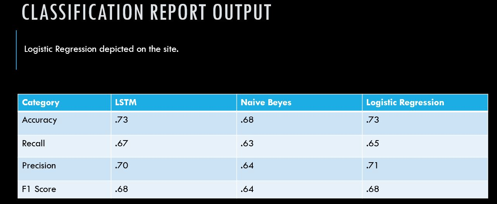

# GT_Final_Project
GT Data Science Final Project
There are many ways to build a model to predict binary sentiment categories by given a piece of text. we are leveraging features in the text to guess the most appropriate classification. logistic regression, Naïve Beyes and LSTM are used to build and evaluate a text classifier.

* Question we have 
1.	Where do we get our test and training data?
2.	Do we have a balanced data? 
3.	What are our features: all words? Top occurring terms?
4.	How we captures those feature?
5.	What application can we use the model for?

* Datasets
https://www.kaggle.com/c/twitter-sentiment-analysis2/data

* Results:
The data scrapped from the latest twitter from 10 politicians, celebrities. The model evaluates and predict the twits to positive or negative categories. 

